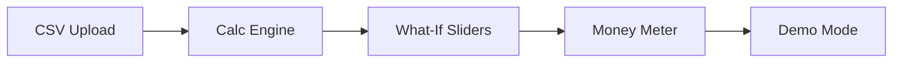
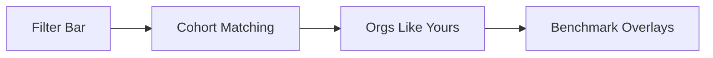

# Feature Sequencing & Dependencies

## Document Purpose
This document defines the implementation order, dependency chains, and milestone alignment for the Assured Partners Survey & Reporting Platform MVP. It ensures features are built in logical sequence with clear prerequisites and handoffs.

## Implementation Phases

### 🏗️ Phase 0: Foundation (COMPLETED)
**Duration:** Sprint 0 (Week 1-2)
**Status:** ✅ Complete

#### Delivered Features:
- [x] Project scaffolding and configuration
- [x] Database schema and models
- [x] Authentication setup (Clerk)
- [x] Basic API routes
- [x] Core UI components
- [x] Development environment

#### Dependencies Met:
- Node.js environment configured
- PostgreSQL database connected
- Redis cache layer ready
- CI/CD pipeline operational
- External services configured

---

### 🚀 Phase 1: Core Data Engine
**Duration:** Sprint 1 (Week 3-4)
**Status:** 🔄 In Progress
**Blocking:** None - Ready to proceed

#### Feature Sequence:

##### 1.1 CSV Upload & Validation ⚡ PRIORITY
**Dependencies:**
- ✅ Database schema (COMPLETED)
- ✅ API routes (COMPLETED)
- ✅ File storage setup (COMPLETED)

**Enables:**
- All data-dependent features
- Demo data loading
- Testing with real datasets

**Implementation Order:**
1. File upload component
2. CSV parsing service
3. Data validation rules
4. Preview interface
5. Error handling

##### 1.2 Calculation Engine Core
**Dependencies:**
- ✅ Database models (COMPLETED)
- ✅ Redis cache (COMPLETED)
- ⏳ CSV data available (1.1)

**Enables:**
- PEPM calculations
- Variance metrics
- What-if modeling
- Performance badges

**Implementation Order:**
1. PEPM calculation service
2. Variance calculation logic
3. Cache integration
4. Performance monitoring
5. Calculation audit trail

##### 1.3 Basic Reporting Grid
**Dependencies:**
- ⏳ Calculation engine (1.2)
- ✅ UI components (COMPLETED)

**Enables:**
- Data visualization
- Drill-down capability
- Export functionality

**Implementation Order:**
1. Grid component
2. Sorting/filtering
3. Column configuration
4. Row expansion
5. Grid state management

---

### 💎 Phase 2: Interactive Features
**Duration:** Sprint 2 (Week 5-6)
**Status:** 📋 Planned
**Blocking:** Phase 1 completion

#### Feature Sequence:

##### 2.1 What-If Modeling Sliders ⚡ CRITICAL PATH
**Dependencies:**
- ⏳ Calculation engine (1.2)
- ⏳ Reporting grid (1.3)
- ✅ Framer Motion setup (COMPLETED)

**Enables:**
- Core value proposition
- Demo wow factor
- Performance showcasing

**Implementation Order:**
1. Slider components
2. Real-time recalculation
3. Performance badge display
4. State persistence
5. Reset functionality

##### 2.2 Money Meter Component ⚡ HIGH IMPACT
**Dependencies:**
- ⏳ What-if calculations (2.1)
- ✅ Animation library (COMPLETED)

**Enables:**
- Executive buy-in
- Value visualization
- Demo centerpiece

**Implementation Order:**
1. Meter component design
2. Counter animation
3. Calculation transparency
4. Responsive positioning
5. Update triggers

##### 2.3 Unified Filter Bar
**Dependencies:**
- ⏳ Reporting grid (1.3)
- ✅ URL state management (COMPLETED)

**Enables:**
- Cross-module navigation
- Context persistence
- Shareable links

**Implementation Order:**
1. Filter bar component
2. State synchronization
3. URL parameter binding
4. Filter chips display
5. Clear/reset actions

---

### 🎯 Phase 3: Intelligence Layer
**Duration:** Sprint 3 (Week 7-8)
**Status:** 📋 Planned
**Blocking:** Phase 2 completion

#### Feature Sequence:

##### 3.1 Cohort Matching Algorithm
**Dependencies:**
- ⏳ Data availability (1.1)
- ⏳ Calculation engine (1.2)

**Enables:**
- Peer comparison
- Benchmark overlays
- Competitive insights

**Implementation Order:**
1. K-NN algorithm implementation
2. Similarity scoring
3. Cohort selection logic
4. Statistical validation
5. Performance optimization

##### 3.2 Organizations Like Yours
**Dependencies:**
- ⏳ Cohort algorithm (3.1)
- ⏳ Filter bar (2.3)

**Enables:**
- Automated benchmarking
- Context-aware comparisons
- Filter shortcuts

**Implementation Order:**
1. Cohort display card
2. Metric calculations
3. Benchmark overlays
4. Apply as filter
5. Ranking indicators

##### 3.3 Advanced Aggregations
**Dependencies:**
- ⏳ Calculation engine (1.2)
- ⏳ Reporting grid (1.3)

**Enables:**
- Trend analysis
- Period comparisons
- Custom groupings

**Implementation Order:**
1. Aggregation service
2. Weighted averages
3. Outlier detection
4. Drill-through navigation
5. Custom grouping UI

---

### 🎨 Phase 4: Visualization & Polish
**Duration:** Sprint 4 (Week 9-10)
**Status:** 📋 Planned
**Blocking:** Phase 3 completion

#### Feature Sequence:

##### 4.1 Chart Framework Integration
**Dependencies:**
- ⏳ Aggregated data (3.3)
- ✅ Dynamic imports setup (COMPLETED)

**Enables:**
- Visual analytics
- Trend visualization
- Export-ready charts

**Implementation Order:**
1. Plotly.js integration
2. Chart component library
3. Responsive sizing
4. Interaction handlers
5. Loading states

##### 4.2 Variance Waterfall Chart
**Dependencies:**
- ⏳ Chart framework (4.1)
- ⏳ Variance calculations (1.2)

**Enables:**
- Variance breakdown
- Visual storytelling
- Click-to-filter

**Implementation Order:**
1. Waterfall component
2. Data transformation
3. Color coding
4. Hover tooltips
5. Click interactions

##### 4.3 Export Engine
**Dependencies:**
- ⏳ All data features
- ⏳ Chart components

**Enables:**
- Report distribution
- Offline analysis
- Stakeholder sharing

**Implementation Order:**
1. CSV export
2. Excel generation
3. PDF creation
4. Chart embedding
5. Batch exports

---

### 🎭 Phase 5: Demo Experience
**Duration:** Sprint 5 (Week 11-12)
**Status:** 📋 Planned
**Blocking:** Phase 4 completion

#### Feature Sequence:

##### 5.1 Guided Demo Mode ⚡ DEMO CRITICAL
**Dependencies:**
- ⏳ All UI features complete
- ✅ Tooltip system (COMPLETED)

**Enables:**
- Self-guided demos
- Stakeholder presentations
- Training mode

**Implementation Order:**
1. Tour framework setup
2. Step definitions
3. UI highlighting
4. Progress tracking
5. Exit/navigation controls

##### 5.2 Demo Data & Scenarios
**Dependencies:**
- ⏳ All features operational
- ⏳ Performance optimized

**Enables:**
- Compelling demonstrations
- Realistic scenarios
- Performance showcasing

**Implementation Order:**
1. Demo data generation
2. Scenario scripts
3. Performance tuning
4. Reset functionality
5. Presenter notes

##### 5.3 Focus/Advanced Toggle
**Dependencies:**
- ⏳ Reporting grid (1.3)
- ⏳ User preferences

**Enables:**
- Executive vs analyst views
- Progressive disclosure
- Role-based UI

**Implementation Order:**
1. Toggle component
2. View configurations
3. State persistence
4. Smooth transitions
5. Default detection

---

## Critical Path Analysis

### 🔴 Critical Path (Must Have for Demo)


**Timeline:** 6 weeks minimum
**Risk:** High - Any delay impacts demo

### 🟡 Important Path (Should Have)


**Timeline:** 4 weeks
**Risk:** Medium - Enhances demo impact

### 🟢 Nice to Have Path


**Timeline:** 3 weeks
**Risk:** Low - Can be simulated if needed

---

## Dependency Matrix

| Feature | Hard Dependencies | Soft Dependencies | Enables | Risk Level |
|---------|------------------|-------------------|---------|------------|
| **CSV Upload** | File storage | - | All data features | 🔴 Critical |
| **Calc Engine** | Database, Redis | CSV data | All calculations | 🔴 Critical |
| **What-If Sliders** | Calc engine | Grid display | Demo wow factor | 🔴 Critical |
| **Money Meter** | What-if calcs | Animations | Executive buy-in | 🔴 Critical |
| **Filter Bar** | Data available | - | Navigation | 🟡 Important |
| **Cohort Matching** | Data, calculations | - | Benchmarking | 🟡 Important |
| **Charts** | Data, Plotly | - | Visualizations | 🟢 Nice to have |
| **Demo Mode** | All features | - | Presentations | 🔴 Critical |

---

## Milestone Schedule

### Milestone 1: Data Foundation ✅
**Target:** End of Sprint 1
**Deliverables:**
- CSV upload working
- Basic calculations operational
- Grid displaying data

**Success Criteria:**
- Can upload and view survey data
- PEPM calculations accurate
- Sub-50ms performance achieved

### Milestone 2: Interactive Demo 🎯
**Target:** End of Sprint 3
**Deliverables:**
- What-if modeling functional
- Money Meter animating
- Filters synchronized

**Success Criteria:**
- Sliders update in real-time
- $2.3M opportunity displayed
- All modules connected

### Milestone 3: Intelligence Layer 📊
**Target:** End of Sprint 4
**Deliverables:**
- Peer comparison working
- Benchmarks overlaying
- Aggregations available

**Success Criteria:**
- 5 similar orgs identified
- Cohort metrics accurate
- Multiple view levels

### Milestone 4: Demo Ready 🚀
**Target:** End of Sprint 5
**Deliverables:**
- Guided tour complete
- All features integrated
- Performance optimized

**Success Criteria:**
- 6-step demo flows smoothly
- No blocking bugs
- Stakeholder approved

---

## Risk Mitigation

### Technical Risks

| Risk | Impact | Mitigation | Fallback |
|------|--------|------------|----------|
| **Calculation performance >50ms** | Demo credibility | Redis caching, query optimization | Show cached results |
| **CSV parsing fails** | No data | Multiple parser libraries | Pre-loaded demo data |
| **Chart library issues** | No visualizations | Static image fallbacks | Server-side rendering |
| **Filter sync problems** | Broken UX | Extensive testing | Separate filter states |

### Schedule Risks

| Risk | Impact | Mitigation | Fallback |
|------|--------|------------|----------|
| **Phase 1 delayed** | Cascade effect | Parallel development where possible | Reduce Phase 4 scope |
| **Integration issues** | Demo incomplete | Daily integration tests | Mock problem features |
| **Performance degradation** | Poor demo | Continuous benchmarking | Optimize or hide slow features |
| **Scope creep** | Timeline slip | Strict phase gates | Cut nice-to-have features |

---

## Parallel Development Opportunities

### Can Be Built in Parallel:
- **UI Components** (while waiting for backend)
- **Animation system** (independent of data)
- **Filter bar** (can use mock data)
- **Export templates** (format agnostic)
- **Demo scripts** (content preparation)

### Must Be Sequential:
- **CSV → Calculations → What-If**
- **Cohort algorithm → Orgs Like Yours**
- **All features → Demo Mode**
- **Charts → Waterfall → Exports**

---

## Feature Toggle Strategy

### Progressive Rollout:
```typescript
const FEATURE_FLAGS = {
  csvUpload: true,          // Phase 1
  calculations: true,        // Phase 1
  whatIfSliders: false,      // Phase 2
  moneyMeter: false,         // Phase 2
  cohortMatching: false,     // Phase 3
  charts: false,             // Phase 4
  demoMode: false,           // Phase 5
}
```

### Graceful Degradation:
- Missing features show "Coming Soon" badge
- Fallback to static data if calculations fail
- Disable sliders if performance degrades
- Hide charts if library doesn't load

---

## Communication Plan

### Daily Standups:
- Current phase progress
- Blocker identification
- Dependency status
- Next 24-hour plan

### Sprint Reviews:
- Milestone assessment
- Demo to stakeholders
- Risk review
- Scope adjustments

### Phase Gates:
- Completion criteria met?
- Dependencies resolved?
- Performance acceptable?
- Proceed/pivot decision

---

## Success Metrics

### Phase Completion:
- [ ] All phase features implemented
- [ ] Dependencies validated
- [ ] Performance targets met
- [ ] No critical bugs
- [ ] Stakeholder sign-off

### Overall Success:
- [ ] Demo runs without errors
- [ ] Performance badges show <50ms
- [ ] All critical path features working
- [ ] Stakeholder excitement generated
- [ ] Funding approved for next phase

---

**Document Owner:** Product Owner
**Last Updated:** January 2025
**Next Review:** After each sprint
**Status:** Active Development Plan