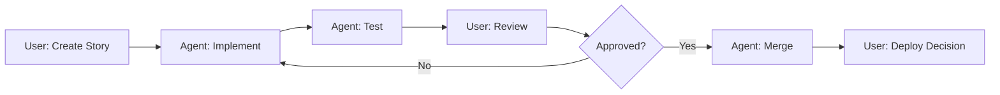
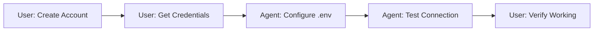
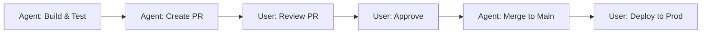

# Ownership Matrix & Responsibility Assignment

## Document Purpose
This document defines clear ownership boundaries, task assignments, and collaboration patterns between human users and AI agents for the Assured Partners Survey & Reporting Platform project.

## Role Definitions

### Human Roles

#### Product Owner (User)
**Primary Responsibilities:**
- Strategic decisions and business requirements
- External service account creation and management
- Payment and purchasing decisions
- API key and credential provisioning
- Final approval on deployments
- Stakeholder communication
- User acceptance testing

**Cannot Delegate:**
- Financial transactions
- Legal agreements
- Security credentials
- Production deployment approval
- Customer communications

#### Platform Administrator (User)
**Primary Responsibilities:**
- Production environment access
- Database credentials management
- SSL certificate provisioning
- Domain DNS configuration
- Cloud provider account management
- Security audit reviews

### AI Agent Roles

#### Development Agent (AI)
**Primary Responsibilities:**
- Code implementation
- Unit test creation
- Code refactoring
- Bug fixes
- Performance optimization
- Documentation generation
- Local testing

**Boundaries:**
- Cannot access production systems
- Cannot make financial decisions
- Cannot create external accounts
- Cannot commit without approval

#### QA Agent (AI)
**Primary Responsibilities:**
- Test case design
- Test execution
- Bug reporting
- Regression testing
- Performance testing
- Accessibility audits
- Test documentation

**Boundaries:**
- Cannot modify production data
- Cannot bypass security protocols
- Cannot approve own fixes
- Cannot deploy to production

#### DevOps Agent (AI)
**Primary Responsibilities:**
- CI/CD pipeline configuration
- Build automation
- Deployment scripts
- Infrastructure as Code
- Monitoring setup
- Log aggregation

**Boundaries:**
- Cannot access production secrets
- Cannot modify security policies
- Cannot change billing settings
- Cannot delete production resources

## Task Assignment Matrix

### 🟢 User-Only Tasks

| Task Category | Specific Tasks | Reason |
|--------------|----------------|---------|
| **Account Management** | Create Clerk account | Requires email verification |
| | Create Neon database | Requires payment method |
| | Create Upstash Redis | Requires billing setup |
| | Create Resend account | Requires domain verification |
| | Create AWS S3 bucket | Requires IAM permissions |
| | Create Vercel account | Requires GitHub authorization |
| **Credentials** | Generate API keys | Security requirement |
| | Store production secrets | Access control |
| | Rotate credentials | Security protocol |
| | Configure OAuth apps | Requires admin access |
| **Financial** | Subscribe to services | Payment authorization |
| | Upgrade plan tiers | Budget approval |
| | Review invoices | Financial oversight |
| **Production** | Approve deployments | Risk management |
| | Rollback decisions | Business impact |
| | Customer communication | Relationship ownership |
| | Incident escalation | Accountability |
| **Legal/Compliance** | Accept terms of service | Legal binding |
| | GDPR compliance review | Legal responsibility |
| | Security audit approval | Compliance requirement |

### 🤖 Agent-Primary Tasks

| Task Category | Specific Tasks | User Involvement |
|--------------|----------------|-----------------|
| **Development** | Write application code | Review PRs |
| | Create database schemas | Approve schema changes |
| | Implement API endpoints | Review API design |
| | Build UI components | Approve UX decisions |
| | Write unit tests | Review coverage |
| **Testing** | Execute test suites | Review results |
| | Generate test data | Approve data patterns |
| | Performance benchmarks | Set thresholds |
| | Accessibility testing | Review compliance |
| **Documentation** | API documentation | Review accuracy |
| | README files | Approve content |
| | Code comments | Ensure clarity |
| | Architecture diagrams | Validate design |
| **Automation** | Build scripts | Approve workflows |
| | Deployment pipelines | Review stages |
| | Monitoring alerts | Set thresholds |
| | Log parsing | Define patterns |

### 🤝 Collaborative Tasks

| Task Category | User Role | Agent Role |
|--------------|-----------|------------|
| **Requirements** | Define business needs | Translate to technical specs |
| **Architecture** | Approve high-level design | Propose implementation details |
| **Security** | Set security policies | Implement security measures |
| **Performance** | Define SLA targets | Optimize to meet targets |
| **Integration** | Provide API credentials | Configure integrations |
| **Deployment** | Approve release | Execute deployment |
| **Monitoring** | Define KPIs | Implement monitoring |
| **Debugging** | Report issues | Investigate and fix |

## Workflow Boundaries

### Development Workflow

### External Service Setup

### Production Deployment

## Communication Protocols

### Status Updates
- **Agents:** Provide detailed progress updates in task tracking
- **Users:** Confirm receipt and provide feedback
- **Frequency:** At each major milestone

### Blockers
- **Agents:** Immediately report blockers with context
- **Users:** Provide guidance or unblock within 24 hours
- **Escalation:** After 24 hours, mark task as blocked

### Decision Points
- **Agents:** Present options with pros/cons
- **Users:** Make decision with rationale
- **Documentation:** Record in decision log

## Responsibility Boundaries

### Code Quality
- **Agent Responsible For:**
  - Following coding standards
  - Writing tests
  - Documentation
  - Performance optimization
  
- **User Responsible For:**
  - Defining standards
  - Reviewing quality
  - Accepting technical debt
  - Setting priorities

### Security
- **Agent Responsible For:**
  - Implementing security best practices
  - Vulnerability scanning
  - Security testing
  - Compliance checking
  
- **User Responsible For:**
  - Security policy definition
  - Credential management
  - Access control
  - Incident response

### Data Management
- **Agent Responsible For:**
  - Data modeling
  - Migration scripts
  - Backup automation
  - Data validation
  
- **User Responsible For:**
  - Data governance
  - Privacy compliance
  - Production data access
  - Retention policies

## Handoff Procedures

### Development to QA
**Agent Deliverables:**
- [ ] Code complete and committed
- [ ] Unit tests passing
- [ ] Documentation updated
- [ ] PR created with description

**Handoff Criteria:**
- All acceptance criteria met
- No known blockers
- Build passing in CI

### QA to Deployment
**QA Deliverables:**
- [ ] Test execution complete
- [ ] Bug reports filed
- [ ] Test report generated
- [ ] Sign-off provided

**Handoff Criteria:**
- All critical bugs fixed
- Performance benchmarks met
- Security scan passed

### Agent to User
**Agent Deliverables:**
- [ ] Task marked complete in tracking
- [ ] Documentation provided
- [ ] Any decisions needed highlighted
- [ ] Next steps identified

**Handoff Criteria:**
- Work meets definition of done
- No outstanding questions
- Ready for user review

## Escalation Matrix

| Issue Type | First Response | Escalation Path | Timeline |
|------------|---------------|-----------------|----------|
| **Blocked by credentials** | Request from user | Mark task blocked | Immediate |
| **Architecture decision** | Present options | Wait for user input | 24 hours |
| **Production issue** | Alert user immediately | Provide diagnosis | < 1 hour |
| **Security vulnerability** | Report with severity | Await prioritization | < 4 hours |
| **Performance degradation** | Analyze and report | Propose solutions | < 8 hours |
| **External service down** | Notify and use fallback | Monitor status | Immediate |
| **Unclear requirements** | Request clarification | Pause work | 24 hours |

## Service-Specific Ownership

### Clerk (Authentication)
- **User:** Account creation, billing, OAuth app configuration
- **Agent:** SDK integration, middleware setup, user flow implementation

### Neon (Database)
- **User:** Project creation, connection string provision, billing
- **Agent:** Schema design, migrations, query optimization

### Upstash (Redis)
- **User:** Database creation, endpoint provision, usage monitoring
- **Agent:** Cache implementation, performance tuning

### Resend (Email)
- **User:** Account setup, domain verification, API key generation
- **Agent:** Template creation, sending logic, error handling

### AWS S3 (Storage)
- **User:** Bucket creation, IAM policies, cost management
- **Agent:** Upload logic, file management, CDN configuration

### Vercel (Deployment)
- **User:** Project linking, environment variables, custom domains
- **Agent:** Build configuration, deployment scripts, optimization

## Review Checkpoints

### Daily Standups
- Agent reports progress
- User provides guidance
- Blockers addressed
- Priorities confirmed

### Weekly Reviews
- Sprint progress assessed
- Quality metrics reviewed
- Upcoming work planned
- Risks identified

### Sprint Retrospectives
- Process improvements identified
- Ownership clarity reviewed
- Handoff procedures refined
- Documentation updated

## Maintenance & Updates

This ownership matrix should be reviewed and updated:
- After each sprint retrospective
- When new team members join
- When new services are added
- When responsibilities shift
- When processes change

**Document Owner:** Product Owner
**Last Updated:** January 2025
**Next Review:** February 2025

## Quick Reference Card

### ❌ Never Agent Tasks
- Create external accounts
- Enter payment information
- Generate production API keys
- Approve production deployments
- Communicate with customers
- Accept legal agreements
- Delete production data

### ✅ Always Agent Tasks
- Write code
- Create tests
- Generate documentation
- Configure CI/CD
- Optimize performance
- Fix bugs
- Create development environments

### 🤔 Check First Tasks
- Modify schemas
- Change API contracts
- Update dependencies
- Alter security settings
- Modify monitoring
- Change deployment process
- Update documentation structure

---

*This document ensures clear accountability and prevents confusion about who should handle what tasks throughout the project lifecycle.*