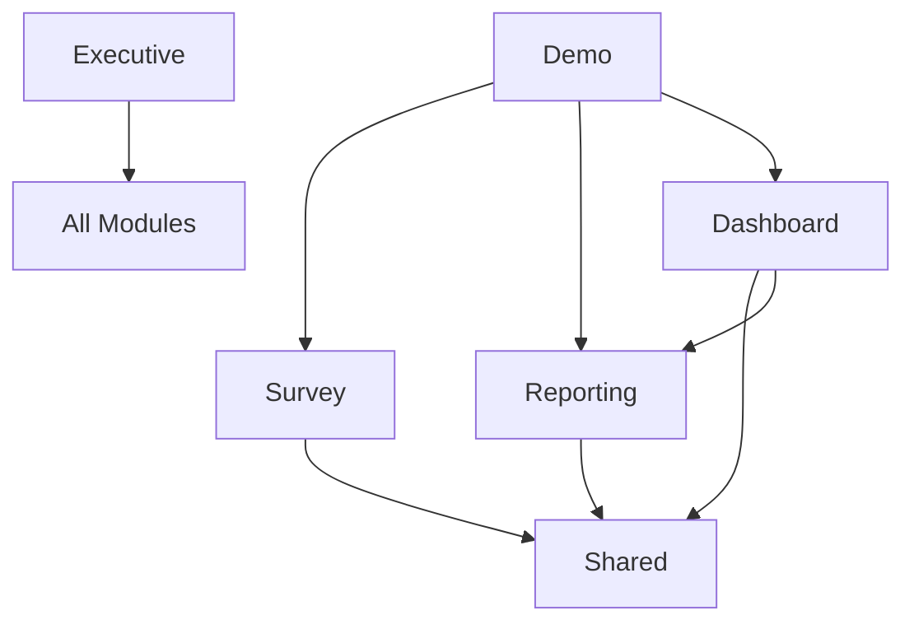

# Module Documentation Structure

## Navigation Guide

This directory contains module-specific documentation for the Assured Partners Survey & Reporting Platform. Each module folder contains all relevant specifications, APIs, components, and testing documentation.

## 📁 Module Structure

### Core Modules
- **[/survey/](./survey/)** - CSV upload, validation, and data ingestion
- **[/reporting/](./reporting/)** - Data grids, calculations, and exports
- **[/dashboard/](./dashboard/)** - Money Meter, What-If modeling, visualizations
- **[/demo/](./demo/)** - Demo mode, scripts, and validation

### Supporting Modules
- **[/shared/](./shared/)** - Cross-cutting concerns, design system, auth
- **[/executive/](./executive/)** - High-level summaries, ROI, metrics

## 🎯 Quick Links by Role

### For Developers
- [API Specifications](./shared/api-common.md)
- [Design System](./shared/design-system.md)
- [Testing Guidelines](./shared/testing-common.md)
- [State Management](./shared/state.md)

### For Product Managers
- [Executive Summary](./executive/summary.md)
- [Feature Roadmap](./executive/roadmap.md)
- [Success Metrics](./executive/metrics.md)

### For Designers
- [Design System](./shared/design-system.md)
- [Component Library](./dashboard/components.md)
- [Accessibility Guidelines](./shared/accessibility.md)

## 📊 Module Dependencies

## 🔍 Finding Information

| If you need... | Look in... |
|---------------|------------|
| CSV upload specs | `/survey/requirements.md` |
| PEPM calculations | `/reporting/api-spec.md` |
| Money Meter component | `/dashboard/components.md` |
| Demo scripts | `/demo/playbook.md` |
| Authentication setup | `/shared/auth.md` |
| ROI calculations | `/executive/roi.md` |

## 📝 Document Maintenance

- Each module has an owner listed in its README
- Updates should be made in the appropriate module folder
- Cross-module changes require updating multiple locations
- Use the [Document Update Checklist](./shared/doc-update-checklist.md)

## 🚀 Getting Started

1. Navigate to your module of interest
2. Start with the module's README.md
3. Review requirements and specifications
4. Check testing documentation for validation

---

**Last Updated:** January 2025
**Maintained By:** Product & Engineering Teams