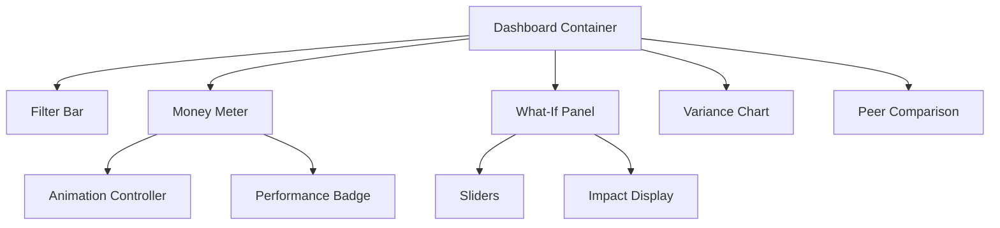

# Dashboard Module Documentation

## Module Overview

The Dashboard module provides the primary interface for data visualization and interactive analysis in the Assured Partners platform. It features the signature Money Meter, What-If modeling capabilities, and real-time performance monitoring.

## 📋 Module Contents

- **[requirements.md](./requirements.md)** - Dashboard feature requirements
- **[components.md](./components.md)** - Money Meter, sliders, and widgets
- **[state-management.md](./state-management.md)** - Real-time updates and state sync
- **[animations.md](./animations.md)** - Motion design and transitions
- **[testing.md](./testing.md)** - Performance and interaction tests

## 🎯 Key Features

### Money Meter
- Animated currency display with 3-second climb effect
- Real-time calculation updates
- Performance badge showing calculation speed
- Drill-down to variance breakdown
- Responsive to What-If adjustments

### What-If Modeling
- Interactive sliders for variable adjustment
- Real-time impact calculation (<50ms)
- Visual difference highlighting
- Scenario comparison
- Reset and save capabilities

### Performance Monitoring
- Live calculation time display
- Query performance tracking
- Cache hit rate visualization
- System health indicators
- User activity metrics

### Peer Comparison
- AI-powered cohort matching
- Similarity scoring algorithm
- Benchmark visualization
- Filter integration
- Competitive positioning

## 🔧 Technical Stack

- **Frontend:** React + TypeScript
- **State:** Zustand + React Query
- **Animation:** Framer Motion
- **Charts:** Recharts
- **Performance:** Web Workers
- **Optimization:** React.memo + useMemo

## 📊 Component Architecture



## ⚡ Performance Requirements

### Response Times
- Initial render: < 1 second
- What-If updates: < 50ms
- Filter application: < 100ms
- Animation FPS: 60fps minimum
- Data refresh: < 500ms

### Optimization Strategies
- Virtual DOM optimization
- Memoization of expensive calculations
- Debounced slider inputs
- Lazy loading of chart data
- Progressive enhancement

## 🎨 Design Specifications

### Money Meter Design
```css
Font: Inter 72px bold
Color: #003D7A (Assured Partners Blue)
Animation: cubic-bezier(0.4, 0, 0.2, 1)
Duration: 3000ms
Format: USD with commas
```

### What-If Sliders
```css
Track: 4px height, #E5E7EB background
Fill: #0066CC (Secondary Blue)
Thumb: 20px circle, white with shadow
Labels: Inter 14px medium
```

## 🧪 Testing Coverage

- Component tests: 85% coverage
- Integration tests: 80% coverage
- Visual regression: All major states
- Performance tests: Animation smoothness
- Accessibility tests: WCAG 2.1 AA

## 📚 Related Documentation

- [Reporting Grid](../reporting/components.md) - Data display components
- [Design System](../shared/design-system.md) - Visual standards
- [State Management](../shared/state.md) - Global state patterns

## 👥 Module Ownership

- **Technical Lead:** Frontend Team
- **Product Owner:** David Kumar
- **UX Designer:** Emily Park
- **QA Lead:** Performance Team

---

**Module Status:** ✅ Production Ready
**Last Updated:** January 2025