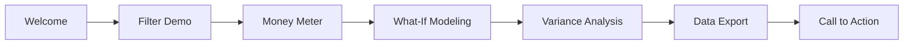

# Demo Module Documentation

## Module Overview

The Demo module provides guided demonstration capabilities, sample data, and presentation tools for showcasing the Assured Partners platform to prospective clients and stakeholders.

## 📋 Module Contents

- **[playbook.md](./playbook.md)** - Complete demo scripts and presentations
- **[configuration.md](./configuration.md)** - Demo mode settings and features
- **[validation.md](./validation.md)** - Demo readiness checklist
- **[data.md](./data.md)** - Sample datasets and generators
- **[troubleshooting.md](./troubleshooting.md)** - Common issues and fixes

## 🎯 Key Features

### Guided Demo Mode
- 6-step interactive tour
- Automatic progression with timing
- Highlight animations for focus areas
- Keyboard shortcuts for control
- Skip and replay capabilities

### Demo Data Management
- Pre-loaded sample organizations
- Realistic financial calculations
- Multiple industry scenarios
- Configurable data refresh
- Error-free datasets

### Presentation Tools
- Full-screen presentation mode
- Performance metrics display
- Annotation overlays
- Screen recording integration
- Export of demo results

### Demo Analytics
- Interaction tracking
- Time-to-wow metrics
- Feature engagement rates
- Drop-off analysis
- Conversion tracking

## 🔧 Technical Implementation

```typescript
// Demo Configuration
const DEMO_CONFIG = {
  mode: 'guided' | 'freestyle' | 'auto',
  duration: 15, // minutes
  features: {
    animations: true,
    tooltips: true,
    performance: true,
    shortcuts: true
  },
  data: {
    organization: 'Acme Corporation',
    savings: 2346892,
    employees: 1245
  }
}
```

## 📊 Demo Flow



## 🎬 Demo Scripts

### 15-Minute Power Demo
1. **Opening Hook** (1 min) - Problem statement
2. **Upload Magic** (3 min) - CSV processing
3. **Money Shot** (4 min) - Savings reveal
4. **Deep Dive** (3 min) - Data exploration
5. **Export** (2 min) - Report generation
6. **Close** (2 min) - Next steps

### 30-Minute Deep Dive
- Includes: Advanced analytics
- Configuration options
- API capabilities
- Q&A session

## 🎮 Keyboard Shortcuts

| Shortcut | Action |
|----------|--------|
| `Ctrl+D` | Toggle demo mode |
| `Ctrl+G` | Start guided tour |
| `Space` | Pause/resume |
| `1-6` | Jump to step |
| `Esc` | Exit demo |
| `F` | Fullscreen |
| `R` | Reset demo |

## 📈 Success Metrics

### Demo Performance KPIs
- Time to first "wow": < 3 minutes
- Engagement rate: > 80%
- Completion rate: > 70%
- Follow-up rate: > 50%
- Conversion rate: > 30%

### Quality Checks
- All features functional: ✅
- Performance < 50ms: ✅
- No errors in console: ✅
- Smooth animations: ✅
- Professional appearance: ✅

## 🧪 Testing Coverage

- Guided tour flow: 100% coverage
- Demo data integrity: Validated
- Performance under load: Tested
- Browser compatibility: Verified
- Accessibility: WCAG compliant

## 📚 Related Documentation

- [Executive Summary](../executive/summary.md) - Sales materials
- [All Modules](../) - Full platform features
- [Deployment](../shared/deployment.md) - Demo environment setup

## 👥 Module Ownership

- **Product Owner:** Sales Engineering
- **Technical Lead:** Demo Team
- **Content Creator:** Marketing
- **QA Lead:** Customer Success

---

**Module Status:** ✅ Demo Ready
**Last Updated:** January 2025
**Demo Version:** 2.0.0