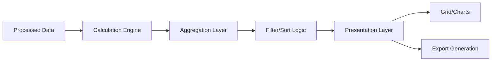

# Reporting Module Documentation

## Module Overview

The Reporting module provides comprehensive data analysis, calculations, and reporting capabilities for the Assured Partners platform. This module transforms processed survey data into actionable insights through interactive grids, visualizations, and exportable reports.

## 📋 Module Contents

- **[requirements.md](./requirements.md)** - Functional requirements for reporting features
- **[api-spec.md](./api-spec.md)** - Calculation and reporting API endpoints
- **[components.md](./components.md)** - Grid, chart, and visualization components
- **[calculations.md](./calculations.md)** - PEPM and variance calculation logic
- **[testing.md](./testing.md)** - Reporting-specific test coverage

## 🎯 Key Features

### Interactive Reporting Grid
- Virtual scrolling for 10,000+ rows
- Column sorting, filtering, and resizing
- Row expansion for detailed views
- Multi-level grouping and aggregation
- Export to Excel with formulas preserved

### Calculations Engine
- PEPM (Per Employee Per Month) calculations
- Variance analysis (actual vs. budget)
- Cumulative tracking across periods
- Peer benchmarking comparisons
- Statistical trend analysis

### Data Visualization
- Variance waterfall charts
- Trend line graphs
- Heat maps for outlier detection
- Comparative bar charts
- Interactive tooltips with drill-down

### Export Capabilities
- PDF reports with charts and tables
- Excel workbooks with multiple sheets
- CSV raw data export
- API access for integrations
- Scheduled report generation

## 🔧 Technical Stack

- **Frontend:** React + TypeScript
- **Grid:** TanStack Table (React Table v8)
- **Charts:** Recharts + D3.js
- **Calculations:** Custom calculation engine
- **Export:** jsPDF, ExcelJS
- **State:** React Query + Zustand

## 📊 Data Flow



## 🧮 Core Calculations

### PEPM Formula
```typescript
PEPM = (Total Claims + Admin Fees - Rebates - Reimbursements) / Member Months
```

### Variance Calculation
```typescript
Variance Amount = Actual - Budget
Variance Percent = (Variance Amount / Budget) * 100
```

### Performance Targets
- Grid render: < 100ms for 1,000 rows
- Calculation update: < 50ms
- Export generation: < 5 seconds
- Filter application: < 200ms

## 🧪 Testing Coverage

- Unit tests: 95% coverage on calculations
- Integration tests: 90% coverage on data flow
- Performance tests: Grid rendering, large datasets
- Accuracy tests: Financial calculations validation

## 📚 Related Documentation

- [Dashboard Components](../dashboard/components.md) - Visualization widgets
- [API Common](../shared/api-common.md) - Shared API patterns
- [State Management](../shared/state.md) - Data flow patterns

## 👥 Module Ownership

- **Technical Lead:** Analytics Team
- **Product Owner:** Michael Chen
- **Primary Developers:** Reporting Service Team
- **QA Lead:** Financial Testing Team

---

**Module Status:** ✅ Production Ready
**Last Updated:** January 2025