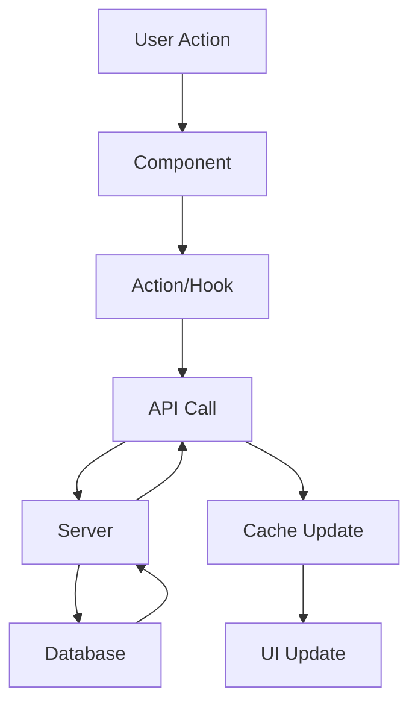

# Shared Resources Documentation

## Module Overview

The Shared module contains cross-cutting concerns, common utilities, and resources used across all modules in the Assured Partners platform. This ensures consistency, reusability, and maintainability.

## 📋 Module Contents

- **[design-system.md](./design-system.md)** - Colors, typography, spacing, components
- **[auth.md](./auth.md)** - Authentication and authorization patterns
- **[api-common.md](./api-common.md)** - Shared API patterns and utilities
- **[state.md](./state.md)** - Global state management patterns
- **[testing-common.md](./testing-common.md)** - Shared test utilities and helpers
- **[accessibility.md](./accessibility.md)** - WCAG guidelines and patterns
- **[performance.md](./performance.md)** - Optimization strategies
- **[security.md](./security.md)** - Security best practices

## 🎯 Core Systems

### Design System
Unified visual language across all modules:
- **Colors:** Brand palette with semantic tokens
- **Typography:** Type scale and font families
- **Spacing:** 4px grid system
- **Components:** Reusable UI elements
- **Animations:** Motion principles

### Authentication System
Centralized auth using Clerk:
- JWT-based authentication
- Role-based access control (RBAC)
- Session management
- SSO integration
- API key management

### API Standards
Consistent API patterns:
- RESTful conventions
- Standard error formats
- Pagination patterns
- Rate limiting
- Response caching

### State Management
Predictable state updates:
- React Query for server state
- Zustand for client state
- Context for theme/auth
- LocalStorage for persistence

## 🔧 Shared Utilities

### Common Functions
```typescript
// Format currency
formatCurrency(value: number): string

// Calculate percentages
calculatePercentage(value: number, total: number): number

// Date formatting
formatDate(date: Date, format: string): string

// Debounce function
debounce<T>(func: T, wait: number): T

// Deep clone
deepClone<T>(obj: T): T
```

### Validation Schemas
```typescript
// Common Zod schemas
export const dateSchema = z.string().regex(/^\d{4}-\d{2}$/);
export const currencySchema = z.number().min(0);
export const percentageSchema = z.number().min(0).max(100);
export const emailSchema = z.string().email();
```

### Error Handling
```typescript
// Standard error class
class AppError extends Error {
  constructor(
    message: string,
    public code: string,
    public statusCode: number
  ) {
    super(message);
  }
}

// Error boundary component
<ErrorBoundary fallback={<ErrorFallback />}>
  {children}
</ErrorBoundary>
```

## 📊 Architecture Patterns

### Component Structure
```
/components
  /ui           - Pure presentational components
  /features     - Feature-specific components
  /layouts      - Page layouts
  /providers    - Context providers
```

### Data Flow Pattern


## 🎨 Design Tokens

### Color System
```scss
// Brand Colors
$primary: #003D7A;      // Assured Partners Blue
$secondary: #0066CC;    // Secondary Blue
$accent: #00A86B;       // Success Green

// Semantic Colors
$error: #DC2626;
$warning: #F59E0B;
$info: #3B82F6;
$success: #00A86B;

// Neutral Scale
$gray-50: #F9FAFB;
$gray-900: #111827;
```

### Typography Scale
```scss
$text-xs: 0.75rem;     // 12px
$text-sm: 0.875rem;    // 14px
$text-base: 1rem;      // 16px
$text-lg: 1.125rem;    // 18px
$text-xl: 1.25rem;     // 20px
$text-2xl: 1.5rem;     // 24px
$text-3xl: 1.875rem;   // 30px
$text-4xl: 2.25rem;    // 36px
```

## 🧪 Testing Utilities

### Test Helpers
```typescript
// Render with providers
renderWithProviders(component: ReactElement)

// Mock API responses
mockApiResponse(endpoint: string, response: any)

// Wait for async updates
waitForLoadingToFinish()

// Generate test data
generateTestOrganization(overrides?: Partial<Organization>)
```

## 📚 Dependencies

All modules depend on shared resources:
- Survey → Shared (auth, design, API)
- Reporting → Shared (calculations, state)
- Dashboard → Shared (components, animations)
- Demo → Shared (all utilities)

## 👥 Module Ownership

- **Design System:** UX Team
- **Authentication:** Security Team
- **API Standards:** Platform Team
- **Testing Utilities:** QA Team

---

**Module Status:** ✅ Production Ready
**Last Updated:** January 2025