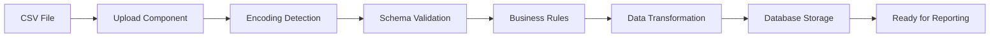

# Survey Module Documentation

## Module Overview

The Survey module handles all aspects of data ingestion, validation, and processing for the Assured Partners platform. This module transforms raw CSV files with up to 1,200 columns into normalized, validated data ready for analysis.

## 📋 Module Contents

- **[requirements.md](./requirements.md)** - Functional requirements and user stories
- **[api-spec.md](./api-spec.md)** - API endpoints for upload and validation
- **[components.md](./components.md)** - UI components for file upload and validation
- **[data-flow.md](./data-flow.md)** - Data processing pipeline and transformations
- **[testing.md](./testing.md)** - Survey-specific test cases and validation

## 🎯 Key Features

### CSV Upload & Processing
- Drag-and-drop file upload interface
- Support for files up to 1,200 columns
- Automatic encoding detection (UTF-8, UTF-8-BOM, CP1252, etc.)
- Real-time validation with row-level error reporting
- Progress tracking with performance metrics

### Data Validation
- Schema validation against expected format
- Business rule validation (PEPM calculations, member counts)
- Duplicate detection and handling
- Missing data interpolation
- Error recovery and correction suggestions

### Performance Targets
- Process 1,200 columns in < 30 seconds
- Validate 10,000 rows in < 5 seconds
- Real-time validation feedback < 100ms
- Support concurrent uploads from multiple users

## 🔧 Technical Stack

- **Frontend:** React + TypeScript
- **Upload:** react-dropzone + axios
- **Validation:** Zod schemas + custom validators
- **Processing:** Web Workers for heavy computation
- **Storage:** S3 for raw files, PostgreSQL for processed data

## 📊 Data Flow

## 🧪 Testing Coverage

- Unit tests: 95% coverage
- Integration tests: 85% coverage
- E2E tests: Upload flow, validation, error handling
- Performance tests: Large file handling, concurrent uploads

## 📚 Related Documentation

- [Design System](../shared/design-system.md) - UI components and patterns
- [API Common](../shared/api-common.md) - Shared API patterns
- [Auth](../shared/auth.md) - Authentication for upload endpoints

## 👥 Module Ownership

- **Technical Lead:** Backend Team
- **Product Owner:** Sarah Chen
- **Primary Developers:** Upload Service Team
- **QA Lead:** Testing Team

---

**Module Status:** ✅ Production Ready
**Last Updated:** January 2025